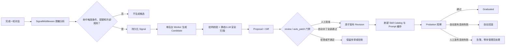

# DeerFlow API Service

基于 [DeerFlow harness](../deer-flow/) 构建的 FastAPI 服务，将 Agent harness 能力暴露为 REST + SSE API。

## 快速启动

```bash
cd deerflow-api

# 1. 安装依赖（uv 管理）
uv sync --frozen --inexact

# 2. 编辑 config.yaml，填入你的 API Key
# 默认使用 DashScope（通义千问），替换 YOUR_DASHSCOPE_API_KEY

# 3. 启动
./start.sh
# 停止
./stop.sh
# 或手动启动：
uv run uvicorn app:app --host 127.0.0.1 --port 8000 --app-dir app
```

服务默认只允许未鉴权的 loopback 监听。若要监听 `0.0.0.0`，请先配置
`api.auth_enabled: true` 和至少一个 `api.api_keys`；只有已由外层网络严格
隔离的可信环境才应显式设置 `api.allow_insecure_remote: true`。

## 飞书与七牛云可选依赖

飞书和七牛云 SDK 是可选依赖，普通的 `uv sync` 不会安装。请在项目根目录按实际需要执行：

```bash
# 仅安装飞书 SDK（lark-oapi）
uv sync --frozen --inexact --extra feishu

# 仅安装七牛云 SDK（qiniu）
uv sync --frozen --inexact --extra qiniu

# 同时安装两者（推荐需要同时启用两个功能时使用）
uv sync --frozen --inexact --extra feishu --extra qiniu
```

`--frozen` 会严格使用仓库现有的 `uv.lock`，`--inexact` 可避免清理由同一虚拟环境中的其他可选包。安装后可分别验证 SDK 是否能被项目环境导入：

```bash
uv run python -c "import lark_oapi; print('Feishu SDK OK')"
uv run python -c "import qiniu; print('Qiniu SDK OK')"
```

### 启用飞书频道

安装 SDK 后，还需要在 `config.yaml` 的 `api:` 下配置飞书应用凭据。建议让密钥来自服务进程环境变量：

```yaml
api:
  feishu:
    enabled: true
    app_id: $FEISHU_APP_ID
    app_secret: $FEISHU_APP_SECRET
    verification_token: $FEISHU_VERIFICATION_TOKEN
```

如果 YAML 中没有填写对应字段，也兼容 `FEISHU_APP_ID`、`FEISHU_APP_SECRET`、`FEISHU_VERIFICATION_TOKEN`，以及相应的 `LARK_*` 环境变量。飞书开放平台侧还需要启用机器人能力并配置长连接事件订阅；这些平台设置不会由依赖安装命令自动完成。

### 启用七牛云 Kodo 工具

安装 SDK 后，将需要的 `qiniu_*` 项合并到 `config.yaml` 已有的 `tools:` 列表中，不要创建第二个 `tools:` 键。以下是上传工具的最小示例：

```yaml
tools:
  - name: qiniu_upload_file
    group: object_storage
    use: deerflow.community.qiniu_kodo.tools:qiniu_upload_file_tool
    access_key: $QINIU_ACCESS_KEY
    secret_key: $QINIU_SECRET_KEY
    bucket: $QINIU_BUCKET
    domain: $QINIU_DOMAIN
    key_prefix: deerflow/{thread_id}/
    private_bucket: false
```

七牛云配置也可以全部由服务进程环境变量提供：`QINIU_ACCESS_KEY`、`QINIU_SECRET_KEY`、`QINIU_BUCKET`、`QINIU_DOMAIN`、`QINIU_KEY_PREFIX` 和 `QINIU_PRIVATE_BUCKET`。下载、列举、查看元数据、删除和生成下载链接等工具的完整模板见 [config.example.yaml](config.example.yaml)。

依赖和配置完成后请重启 API 服务；systemd、Docker 或多 worker 部署需要更新实际运行环境并重启所有 worker。若启动时仍提示缺少 SDK，请确认安装命令与启动命令都在本项目目录执行，并使用同一个 `.venv`（推荐始终通过 `uv run` 启动）。

## 配置方式

运行参数优先写入 `config.yaml` 的 `api:` 段，例如监听地址、端口、CORS、上传限制、默认 agent 模式、并发子 agent 数和 DeerFlow 数据目录。旧的 `DEER_FLOW_*`、`HOST`、`PORT` 环境变量仍作为兼容 fallback，但常规部署不再需要 `.env`。

```yaml
api:
  host: 127.0.0.1
  port: 8000
  deerflow_home: ./data/deerflow
  plan_mode: true
  subagent_enabled: true
  max_concurrent_subagents: 3
  chat_request_timeout: 600
  cors_allow_origins:
    - http://localhost:3000
    - http://127.0.0.1:3000
  max_upload_size_mb: 25
  max_uploads_per_request: 10
```

Tracing 也放在 `config.yaml.tracing` 下；密钥可以直接写入 YAML，也可以用 `$ENV_NAME` 占位符继续从环境变量读取：

```yaml
tracing:
  langfuse:
    enabled: false
    public_key: $LANGFUSE_PUBLIC_KEY
    secret_key: $LANGFUSE_SECRET_KEY
    host: https://cloud.langfuse.com
```

仍建议保留在环境变量中的只有进程级或系统级凭据/变量，例如 `CLAUDE_CODE_OAUTH_TOKEN`、`CLAUDE_CODE_OAUTH_TOKEN_FILE_DESCRIPTOR`、`ANTHROPIC_AUTH_TOKEN`、`HOME`、`SystemRoot` 等。

## Checkpoint 与长期记忆

本分支已同步字节 DeerFlow 近期的 checkpoint / memory 优化思路：checkpoint 支持 `full`、`delta` 双模式和可配置快照频率；delta 历史可使用进程内 LRU 或 Redis 缓存。模式与快照频率都是进程级冻结配置，修改后必须重启所有共享同一 checkpoint 数据库的进程。`full -> delta` 可直接读取；`delta -> full` 会 fail-closed，避免把 delta sentinel 误当成空状态。

长期记忆通过 `MemoryManager` 接口选择后端。默认 `deermem` 兼容原有 JSON + FTS5 行为；`mem0` 使用 HTTP API，API Key 只从 `backend_config.api_key_env` 指定的环境变量读取。mem0 不会自动迁移 DeerMem 数据。

记忆支持 `middleware` 自动召回和 `tool` 按需召回两种模式；tool 模式会注册 `memory_search`，运行时 `user_id`、`agent_name`、`thread_id` 会分别映射到 mem0 的用户、Agent 和 run 作用域。

启用 API 鉴权后，可在 `/management/` 的“长期记忆”区域编辑完整 Memory 配置，先执行校验/后端测试，再“保存并应用”。mem0 的实际 API Key 不会写入或回显到管理页面，必须预先放入服务进程环境变量；页面只保存环境变量名。切换 DeerMem、mem0 或自定义后端不会自动迁移已有数据。

Linux 生产部署时，运行用户必须对 `config.yaml` 和 DeerMem 数据所在目录有写权限，以便创建 `.config.yaml.lock`、`.memory.json.lock` 及同目录原子临时文件。单机多 worker 必须共享相同的配置、数据和锁文件目录；由于热重载只作用于接收管理请求的进程，多 worker 部署在保存后仍应滚动重启全部 worker。上线前请备份 `config.yaml` 和 DeerMem 数据文件，并用 `/health/ready` 与管理页“测试后端”复核。

完整配置、迁移规则和故障策略见 [Checkpoint 与记忆优化说明](docs/checkpoint-memory-optimizations.md)，可直接复制的 YAML 见 [config.example.yaml](config.example.yaml)。

## Skill Self-Improving（技能自我改进）

当前项目的 self-improving 是一个**只演进自定义 Skill、默认人工审核、支持受限自动补丁**的闭环。它不会自行修改项目源码、`config.yaml` 或 `skills/public/` 内置 Skill；所有候选先进入隔离目录并生成 Proposal，只有通过审核或严格的 `auto_patch` 门槛后，才会发布到 `skills/custom/`。

该能力推荐先以 `review` 模式上线：

```yaml
skill_evolution:
  enabled: false
  mode: review                 # review 或 auto_patch
  storage_path: skill-evolution
```

`storage_path` 的相对路径会从 DeerFlow 数据根目录解析。修改 `enabled`、运行模式或模型配置后应重启 API；启动时会恢复尚未处理完的自动发现 Signal。

### 工作链路



系统有两种候选入口：

- **Agent 主动提案**：启用后，主 Agent 会获得 `skill_manage` 工具，可为自定义 Skill 提交 `create`、`edit`、精确 `patch`、`delete` 和支持文件变更。工具只创建 Proposal，不直接修改正在使用的 Skill；人工来源的 Proposal 即使在 `auto_patch` 模式下也不会自动发布。
- **自动发现**：同时启用 `discovery.enabled` 后，`EvolutionSignalMiddleware` 只分析已经产生最终回答的最近一轮对话。用户纠正、工具调用过多、错误恢复、重复任务，以及使用 Skill 后出现未恢复错误或下一轮明确纠正，都可能成为 Signal。摘要会移除常见密钥、Bearer Token、URL 查询参数和长 Token，并受重复窗口、冷却时间、每日 Proposal 数和待审数量限制。

Signal 持久化后由单个后台 Worker 异步处理，不阻塞当前用户响应。生成模型只能返回 `skip`、创建新 Skill 或对现有 `SKILL.md` 做精确替换；自动生成器不允许提出脚本、支持文件、删除、Shell 命令、凭据、权限或 URL。证据不足、输出不合法或模型不可用时会安全地 `skip`。

### 校验、审核与发布边界

每个 Candidate 都会检查 Skill 名称和 frontmatter、路径穿越、符号链接、嵌套 `SKILL.md`、支持文件目录、UTF-8，以及文件数量和大小限制。受管理的文本还会经过确定性静态扫描和独立的 LLM 安全扫描；静态规则判定为 `block` 时模型不能覆盖。默认 `security_fail_closed: true`，安全模型不可用或输出异常时拒绝候选。

`review` 模式下所有 Proposal 都需要管理员批准。`auto_patch` 也不是全自动写权限：只有自动发现产生、风险为低、仅修改现有自定义 Skill 的 `SKILL.md`、改动行数未超限、不新增 URL/Shell/权限/环境变量/凭据内容、所有安全扫描明确 `allow`、基础版本哈希未变化，并且独立质量评估也明确 `allow` 的精确补丁才能自动发布。自动创建、删除、脚本和支持文件变更始终需要人工处理。

批准发布前会重新扫描 Candidate，并用 Proposal 创建时的 Skill 树 SHA-256 做乐观并发检查，不会覆盖后来修改的新内容；人工发布冲突会把 Proposal 标记为 `stale`，自动发布冲突则安全降级回 `pending_review`。发布器在进程内锁下创建不可变 Revision 快照、使用 staging/backup 目录原子替换活动 Skill、递增 Catalog 版本，并刷新 Skill Prompt 缓存。管理员直接编辑自定义 Skill 也复用同一套版本事务和静态校验。

### Probation、回滚与管理入口

每个普通发布且未删除的 Revision 都进入 probation，删除和回滚操作除外。默认观察该 Skill 后续 3 次实际使用：正常使用会清零连续失败计数；使用后存在未恢复工具错误，或下一轮用户明确纠正，会记录为失败。达到连续 2 次失败时，自动发布的 Revision 会回滚到上一版本；人工批准或管理员直接发布的 Revision 只产生回归告警，不自动撤销。即使暂停 `discovery.enabled`，只要 `skill_evolution.enabled` 仍开启，已有 probation 仍会继续观察。

启用 API 鉴权后，可在 `/management/` 的 **Skill Self-Improving** 区域查看脱敏 Signal、工具错误摘要、Proposal Diff、安全扫描、质量评估和 probation 状态，并执行批准、拒绝、归档、恢复、Revision 查看及手动回滚。启用飞书频道后，也可以通过 `/proposals` 查看当前会话的待审 Proposal，并在交互卡片中批准或拒绝；两种入口调用同一发布服务和并发校验。

演进状态默认持久化为 `state.json`、`signals/`、`proposals/`、`revisions/` 和 `audit.jsonl`。Signal 虽然做了规则脱敏，但不应视为完整 DLP；候选 Skill、Diff 和扫描内容还可能发送给配置的生成、审核或评估模型。该文件存储实现按**单用户、单写入进程**设计，锁只在进程内协调；多 worker 部署应把 Proposal 审批、发布、回滚和自动 Worker 固定到一个写入进程，或在扩展为跨进程协调存储后再开放并发写入。

## 本地 ACP Agent（Zed 等客户端）

项目可作为标准 **ACP v1 Agent** 由 Zed 或其他 ACP client 在本机使用。推荐采用多窗口共享 daemon 的 Bridge 模式：

```text
Zed stdio <-> Rust Bridge <-> 127.0.0.1 随机端口 <-> 常驻 deerflow-acpd
```

- Zed 只启动体积很小的 Rust Bridge；Bridge 不加载 Python、模型、工具或 Sandbox。
- `deerflow-acpd` 常驻并复用 DeerFlow graph、SQLite checkpointer、会话库和已唤醒的 WSL2。
- Bridge 默认会在 daemon 不存在时自动启动它，然后透明转发 ACP JSON-RPC。
- 同一用户可从多个 Zed/编辑器窗口同时连接；每个 Bridge 使用独立 ACP transport，一个活动 session 同时只附着到一个窗口。窗口断开后仅取消自己的运行并释放临时 client MCP，历史 session 可由其他窗口重新加载。
- 每个窗口通过 `session/new` 获得不同的 `sessionId`；daemon 将该值原样用作 DeerFlow/LangGraph 的 `thread_id`，因此 checkpoint、取消、权限请求和运行状态都按 session 隔离。
- `max_active_connections` 限制同时打开的本地 ACP transport（默认 16），`max_active_runs` 独立限制真正执行中的 prompt（默认 2）；更多 prompt 会在 daemon 内等待运行槽位，等待时间计入 `run_timeout_seconds`。
- session 隔离不等于文件系统隔离：指向同一 `cwd` 的窗口仍会读写同一棵目录，默认的 `memory_scope: workspace` 也会共享该 workspace 的 Memory；需要强隔离时应使用不同 worktree/cwd，并把 Memory 改为 `session`。
- 多窗口能力仅针对本机 stdio Bridge。`--gateway` 仍只暴露一个外部逻辑 transport，新连接会替换旧连接；这里不把受信任本机模型扩展成远程多租户模型。
- 内部端口只监听 loopback，并使用每次启动生成的随机 token；不经过 HTTP/AG-UI，不需要 WSS 或 API Key。

### 构建与 Zed 配置

先构建 Bridge：

```powershell
cargo build --release --manifest-path D:\Tools\deerflow-api\bridge\Cargo.toml
```

Zed 的 `settings.json` 可添加一个 custom agent server。Windows 示例（路径按实际项目位置修改）：

```json
{
  "agent_servers": {
    "DeerFlow Local": {
      "type": "custom",
      "command": "D:\\Tools\\deerflow-api\\bridge\\target\\release\\deerflow-acp.exe",
      "args": ["--config", "D:\\Tools\\deerflow-api\\config.yaml"]
    }
  }
}
```

指定 `--config` 后，Bridge 会优先发现配置文件同目录下的 `.venv\Scripts\python.exe`。打包发行时也可显式添加 `--python <PATH>`，或者通过 `DEER_FLOW_ACP_PYTHON` 指定随包 Python；Bridge 将执行 `python -m deerflow.acp.daemon`。`--daemon <PATH>` 和 `DEER_FLOW_ACP_DAEMON` 仅用于兼容已有的 `deerflow-acpd` console script。

### daemon 生命周期

Zed 第一次连接时会自动启动 daemon。若希望登录 Windows 后提前完成 graph 和 WSL2 预热，可把下面的 `--start-daemon` 命令放入当前用户的登录任务：

```powershell
# 启动、查看状态、重启和停止
.\acp-service.ps1 start
.\acp-service.ps1 status
.\acp-service.ps1 restart
.\acp-service.ps1 stop
```

脚本默认使用项目根目录的 `config.yaml` 和 `bridge\target\release\deerflow-acp.exe`，也可传入 `-ConfigPath`、`-BridgePath`、`-PythonPath` 或 `-RuntimeDir`。它内部仍调用 Bridge 的 daemon 生命周期命令，因此启动会等待预热完成，停止会先请求优雅关闭，并在 Bridge 配置的超时后处理未退出进程。

如果只希望手动执行一次并让 daemon 脱离当前 PowerShell 常驻后台，可以使用简化入口：

```powershell
# 默认动作是 start；等待 daemon 就绪后脚本返回
.\acp-daemon.ps1
.\acp-daemon.ps1 status
.\acp-daemon.ps1 restart
.\acp-daemon.ps1 stop
```

`acp-daemon.ps1` 不注册 Windows Service 或计划任务，只复用 `acp-service.ps1` 调用原生 Bridge。Bridge 会以无窗口、空 stdio 和独立进程组启动 Python daemon；脚本在 daemon 预热并发布 endpoint 后返回，随后关闭 PowerShell 不会停止 daemon。daemon 异常退出时仍由下次 Zed Bridge 连接的默认 auto-start 重新拉起。

`--status` 和 `--stop-daemon` 不会自动启动 daemon。端点、随机 token 和日志默认保存在当前用户的 `%LOCALAPPDATA%\DeerFlow\acp`；Linux 使用 `XDG_RUNTIME_DIR` 或 `XDG_CACHE_HOME`。可用 `--runtime-dir` 或 `DEER_FLOW_ACP_RUNTIME_DIR` 覆盖。Bridge 默认等待 daemon 预热 120 秒；特别慢的环境可用 `DEER_FLOW_ACP_DAEMON_START_TIMEOUT_MS` 调整。

`--stop-daemon` 会先请求优雅关闭，并等待 endpoint 中记录的 daemon PID 真正退出；默认等待 10 秒，超时后会强制终止已通过 token 验证的旧进程。可用 `DEER_FLOW_ACP_DAEMON_STOP_TIMEOUT_MS` 调整优雅关闭等待时间。

默认启动会预构建 agent graph，并在配置为 WSL Sandbox 时执行一次无副作用的 `true` 探针。排障时可分别设置 `DEER_FLOW_ACP_DAEMON_WARMUP=0`、`DEER_FLOW_ACP_DAEMON_SANDBOX_WARMUP=0`；调整启动等待时间可设置 `DEER_FLOW_ACP_DAEMON_START_TIMEOUT_MS`。

### 直接 stdio 回退

原有 Python 入口继续保留，适合验证协议或 daemon/Bridge 故障排查，但每次都会重新加载 DeerFlow，不具备热启动优势：

```powershell
uv run deerflow-acp
# 等价方式：uv run python -m deerflow.acp
```

使用直接入口前应先停止常驻 daemon，避免两个本地 Agent 同时操作同一 ACP 会话库。

这个入口定位为本地通用任务 Agent，不提供终端、LSP、代码诊断或 diff 等编码客户端集成：

- Prompt 支持文本和 ACP `ResourceLink`。本地 `file:` 资源必须是真实存在且位于当前 session 的 `cwd` 内，并受 `resource_link_max_size_mb` 限制；`http/https` 链接只作为用户提供的数据引用传给 Agent，不会由适配层自动下载。暂不接受 embedded resource、图片或音频输入。
- 支持多轮会话、完整历史重放、会话列表、`session/close`、取消、思考、计划、工具进度和本地产物链接。关闭的会话立即从列表和加载接口隐藏，超过 `closed_session_retention_days` 后会在 daemon/stdio 下次启动时连同 checkpoint 一起清理。
- 新建或加载会话时，会通过稳定版 ACP `configOptions` 暴露 `models:` 中配置的模型和服务端批准的 Agent Profile；支持该能力的客户端可按 session 选择。Profile 会实际应用其默认模型、工具组和 Skill 白名单，选择结果会持久化，且只能在 session 没有正在执行的 prompt 时切换。
- Zed 通过 `session/new` 传入的绝对 `cwd` 会绑定为该会话的 `/mnt/user-data/workspace`。Agent 可在这个目录内列举、搜索、读取、写入、替换、移动/重命名和删除文件或目录；路径穿越以及通过符号链接或 junction 逃出工作区会被拒绝。
- `cwd` 必须是已经存在的本地目录，加载会话时必须与创建会话时的目录一致。非空 `additionalDirectories` 会被明确拒绝。
- 系统提示词由 DeerFlow 基础提示词、服务端持有的本地 ACP 安全约束和可选的 `local_acp.prompt_overlay` / `prompt_overlay_file` 组成。ResourceLink、网页、Memory 和 MCP 返回值都被明确标记为数据，不能充当系统指令或权限授权；客户端普通消息不能覆盖这层系统策略。
- 工具面由同一份有效能力策略过滤。可用 `tool_allowlist` 设置硬白名单、用 `tool_denylist` 追加禁用项；外部 `invoke_acp_agent` 和持久化 scheduled-task 工具在本地 ACP 中始终不可用，避免提示词宣告并不存在或缺少后台服务的能力。
- `permission_mode` 支持 `off`、`dangerous` 和 `all`。默认 `dangerous`：读取/本地搜索/思考类工具直接执行，编辑、删除、移动、命令、网络访问及未知类型工具先通过 ACP `requestPermission` 请求客户端批准；`allow always` / `reject always` 只在当前 session 和工具名范围内记忆。客户端没有权限处理器或连接已断开时，受保护工具默认拒绝。
- 可用 `local_acp.subagent_enabled: true` 开启内部 DeerFlow subagent，并用 `max_concurrent_subagents` 限制并发。subagent 继承父 Agent 的工具组、Skill 白名单、ACP allow/deny 策略和 permission middleware，不允许递归委派；其 token usage 会计入 ACP 响应，父 turn 被取消时会向后台任务发送协作式取消信号。外部 ACP agent 仍不开放。
- 工作区访问直接使用本机路径，不调用 ACP client 的文件系统或终端接口。默认不暴露 `bash`；受信任的本地客户端可设置 `local_acp.enable_bash: true`，或环境变量 `DEER_FLOW_ACP_ENABLE_BASH=1`，通过配置的 Sandbox 启用。Bash 可访问网络及 Sandbox 可见的文件系统；WSL 的 Windows 挂载盘不构成严格的项目隔离边界。
- 该模式要求 `LocalSandboxProvider` 或 `LocalWslProvider`；AIO/Docker sandbox 不会静默回退到 DeerFlow 内部 workspace。
- client MCP 默认拒绝。受信任的本地客户端可设置 `local_acp.accept_client_mcp_servers: true`，或环境变量 `DEER_FLOW_ACP_ACCEPT_CLIENT_MCP_SERVERS=1`，启用按会话隔离、仅驻留内存的 stdio、SSE 和 HTTP（Streamable HTTP）MCP。远程 MCP URL 和 Header 均由客户端提供；这些 session 临时工具不会自动下放给内部 subagent。该开关会增加外部命令、出站连接和工具面，并退出严格的“仅项目目录文件操作”边界，当前文件模式不应开启。
- Memory 默认按规范化后的 workspace 隔离，也可通过 `memory_scope: global | workspace | session` 改为全局共享或每 session 独立；daemon/runtime 优雅关闭时会等待 Memory 更新队列 flush。
- DeerFlow 的 uploads、outputs、ACP 外部 agent workspace 和会话状态仍保存在自己的线程目录中，不会混入客户端项目。
- ACP 使用独立的 `acp-checkpoints.db` 和 `acp-sessions.db`，可与 HTTP API 同时运行而不共享 SQLite 写热点。

可选配置见 `config.example.yaml` 的 `local_acp:`。也可用 `DEER_FLOW_ACP_CHECKPOINTER_PATH`、`DEER_FLOW_ACP_SESSION_STORE_PATH`、`DEER_FLOW_ACP_MAX_ACTIVE_CONNECTIONS`、`DEER_FLOW_ACP_MAX_ACTIVE_RUNS`、`DEER_FLOW_ACP_RUN_TIMEOUT`、`DEER_FLOW_ACP_ENABLE_BASH` 和 `DEER_FLOW_ACP_ACCEPT_CLIENT_MCP_SERVERS` 覆盖运行参数。Bridge 的 stdout 只承载 ACP JSON-RPC；daemon 日志写入独立轮转文件。

## 外部 ACP Agent 对接（Codex / Claude Code）

项目支持作为 **ACP client** 调用外部 agent。配置 `config.yaml` 的 `acp_agents:` 后，DeerFlow 会自动暴露内置工具 `invoke_acp_agent`，主 agent 可以把编码、审查、重构等任务交给外部 ACP agent 执行。

> ACP 这里指 Agent Client Protocol。被启动的外部命令必须实现 ACP 协议；裸 `codex` 或 `claude` CLI 通常不能直接作为 ACP agent 使用，需要对应的 ACP adapter。

示例：

```yaml
acp_agents:
  codex:
    command: codex-acp
    args: []
    description: "Codex coding agent via ACP"
    model: null
    auto_approve_permissions: false

  claude_code:
    command: claude-agent-acp
    args: []
    description: "Claude Code coding agent via ACP"
    model: null
    auto_approve_permissions: false
```

常见 adapter 安装方式：

```bash
# Codex ACP adapter
npm install -g @zed-industries/codex-acp

# Claude Code ACP adapter
npm install -g @agentclientprotocol/claude-agent-acp
```

运行机制与注意事项：

- `command`/`args` 会作为子进程启动，并通过 ACP `initialize -> new_session -> prompt` 流程调用。
- 每个会话线程有独立 ACP 工作目录；外部 agent 产物会映射到 DeerFlow 的 `/mnt/acp-workspace/`。
- `auto_approve_permissions` 默认应保持 `false`。改为 `true` 后，DeerFlow 会自动批准 ACP agent 的权限请求，适合受信环境，不适合开放服务。
- `acp_agents` 是“把 Codex/Claude Code 当外部 agent 调用”；项目也支持把 Codex/Claude Code 凭据配置成主模型 provider，这两种能力互相独立。

## Windows 沙箱（WSL 模式）

Windows 上 `LocalSandboxProvider` 会回退到 PowerShell/cmd.exe，与上游 agent prompts 的 bash 语义不兼容；同时开启 `allow_host_bash: true` 后 LLM 命令直接在 Windows 主机权限下执行，没有任何隔离。

为此提供 `LocalWslProvider`：**bash 跑进 WSL2，文件 I/O 仍在 Windows 上**——agent prompt 原生可用，进程层面有 VM 隔离，性能与现有线程目录全部沿用。

### 前提
- Windows 10/11 + 已安装 WSL2 与一个 Linux distro（推荐 `Ubuntu-22.04`）
- WSL 版本 ≥ 0.64.0（启用 `WSL_UTF8` 环境变量支持，避免输出乱码）
- 用 `wsl -l -v` 确认 distro 存在且为 Version 2

### 启用方式
编辑 `config.yaml` 的 `sandbox:` 段：

```yaml
sandbox:
  use: deerflow.sandbox.local:LocalWslProvider   # 也可以写短别名 'wsl'
  wsl_distro: Ubuntu-22.04       # 留空则使用默认 distro
  wsl_user: null                 # 留空则使用 distro 的默认用户
  wsl_shell: bash                # 也可以填 zsh
  wsl_mount_prefix: /mnt         # 与 /etc/wsl.conf 的 automount.root 一致
```

不需要再开 `allow_host_bash`——非 local provider 默认放行 bash 工具与 bash 子代理。

### 路径映射
agent 看到的虚拟路径 → Windows 主机路径 → WSL 路径自动来回翻译：

| Agent 视角 | Windows 实际位置 | WSL 视角 |
|---|---|---|
| `/mnt/user-data/workspace/x.py` | `D:\Tools\deerflow-api\data\threads\<tid>\user-data\workspace\x.py` | `/mnt/d/Tools/deerflow-api/data/threads/<tid>/user-data/workspace/x.py` |
| `/mnt/skills/<name>` | `D:\Tools\deerflow-api\skills\<name>` | `/mnt/d/Tools/deerflow-api/skills/<name>` |

bash 输出里的 `/mnt/<drive>/...` 会被自动还原成虚拟路径再返回给 agent，主机绝对路径不会泄漏。

### 安全说明
- **不是真"安全沙箱"**：WSL2 默认能读写 `/mnt/c/...`、能访问 `%USERPROFILE%`。比直跑 PowerShell 安全一个量级，但弱于 Docker/AioSandbox。
- 启动失败有明确报错：未装 WSL、`wsl.exe` 不在 PATH、distro 未注册、非 Windows 主机都会在启动期硬失败。
- 真要强隔离仍需后续移植 `AioSandboxProvider` + Docker Desktop。

### 故障排查
- `WslUnavailableError: wsl.exe was not found` → 安装 WSL：`wsl --install`
- `WslDistroNotFoundError: ...is not registered` → 检查 `wsl -l -q` 输出，确认配置的 `wsl_distro` 拼写
- bash 输出乱码 → 升级 WSL：`wsl --update`（需 ≥ 0.64.0 以支持 `WSL_UTF8`）
- `bash` 工具返回 `Host bash execution is disabled` → 确认 `sandbox.use` 真的指向 `wsl` 而不是 local

## 项目结构

```
deerflow-api/
├── app/
│   ├── __init__.py          # FastAPI app + lifespan
│   ├── config.py            # 服务配置
│   ├── dependencies.py      # ClientManager 单例
│   ├── schemas.py           # Pydantic 请求/响应模型
│   └── routers/
│       ├── chat.py          # POST /api/chat + /api/chat/stream（SSE）
│       ├── threads.py       # 线程管理
│       ├── models.py        # 模型列表
│       ├── skills.py        # 技能管理
│       ├── mcp.py           # MCP 配置
│       └── uploads.py       # 文件上传/下载
├── config.yaml              # DeerFlow harness 配置
├── config.example.yaml      # 配置模板
├── skills/public/           # 21 个内置 skills
├── start.sh                 # 启动脚本
├── stop.sh                  # 停止脚本
└── pyproject.toml           # uv 项目定义
```

## 核心设计

- **uv 管理依赖** — 使用 `uv sync` 安装，虚拟环境在 `.venv/`
- **ClientManager 单例** — 全局共享 `DeerFlowClient`，按配置 key 缓存 agent
- **Lazy Agent** — 内部 agent 延迟创建，首次调用时才初始化
- **默认 Ultra 能力** — 默认启用 `plan_mode` 与 `subagent_enabled`，支持自主规划和最多 3 个子 agent 并行任务
- **SQLite 持久化** — 默认 SQLite checkpointer，重启不丢失对话
- **精简依赖** — 移除了 markitdown（onnxruntime 不兼容 Python 3.14），社区工具作为可选依赖

## 依赖精简

从原 harness 移除了：
- ❌ `markitdown[all,xlsx]` → 改用 markitdown 基础版（可选依赖）
- ❌ `kubernetes` → 移至可选依赖 `[sandbox-docker]`
- ❌ `tavily-python`, `firecrawl-py`, `exa-py`, `ddgs` → 社区工具已移除

当前核心依赖约 **126 个包**，虚拟环境 **~395MB**。

## API 端点

启动后访问 http://localhost:8000/docs 查看 Swagger UI

### 对话
| 方法 | 端点 | 说明 |
|------|------|------|
| `POST` | `/api/chat` | 同步对话 |
| `POST` | `/api/chat/stream` | SSE 流式输出 |

请求体支持运行模式覆盖：

```json
{
  "message": "分析这个项目并给出改造计划",
  "plan_mode": true,
  "subagent_enabled": true,
  "max_concurrent_subagents": 3
}
```

- `plan_mode`: 启用 `write_todos` 规划/追踪能力
- `subagent_enabled`: 启用 `task` 工具，由主 agent 分派子 agent
- `max_concurrent_subagents`: 每轮最多并行子 agent 数，范围 2-4，默认 3

### 线程 / 模型 / 技能 / MCP / 文件
详见 `/docs` 交互文档
